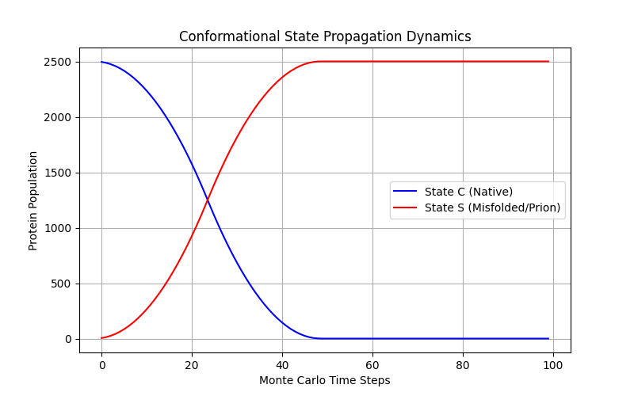

# Conformation Dynamics: A Physics-Based Model of Protein State Propagation

A statistical physics and lattice simulation model exploring non-genetic conformational state propagation in proteins, using thermodynamic transition rules.

---

## 🔬 Core Scientific Question
> **Can a minimal physics-based lattice model reproduce the self-propagating conformational dynamics observed in prion biology using only thermodynamic transition rules without genetic material?**

---

## 📚 Related Work & Background
Prion diseases are characterized by the non-genetic conversion of native proteins ($\text{PrP}^C$) into infectious misfolded isoforms ($\text{PrP}^{Sc}$), a paradigm established by **Stanley Prusiner (Nobel Prize 1997)**. 

Classical biophysical models explain this via:
1. **Nucleated Polymerization Model (Jarrett & Lansbury, 1993):** Proposes that monomer conversion is unfavorable until a critical oligomeric "seed" forms.
2. **Template-Assisted Refolding Model:** Proposes a high activation barrier that is catalyzed upon binding to a misfolded template.

*This project presents a coarse-grained spatial lattice model focusing on local mean-field kinetics and contact-induced activation barrier lowering, abstracting away atomic-level structural details to evaluate purely thermodynamic drivers.*

---

## 📐 Mathematical & Physical Framework

### 1. Spontaneous Conformational Transition
Isolated native state ($\text{State } C$) transitioning to misfolded state ($\text{State } S$) via Boltzmann thermal activation:

$$P_{\text{spontaneous}} = \exp\left(-\frac{\Delta E}{k_B T}\right)$$

### 2. Catalytic / Induced Transition
Contact with misfolded neighbors ($N_S \in \{0,1,2,3,4\}$) lowers the effective activation energy barrier $\Delta E$:

$$\Delta E_{\text{eff}} = \max\left(0, \Delta E - (\Delta E_{\text{lowering}} \cdot N_S)\right)$$

$$\text{Rate}_{\text{induced}} = k_{\text{cat}} \cdot N_S \cdot \exp\left(-\frac{\Delta E_{\text{eff}}}{k_B T}\right)$$

$$P_{\text{induced}} = 1 - \exp\left(-\text{Rate}_{\text{induced}}\right)$$

---

## 📊 Model Benchmarking & Analytical Validation

To evaluate the numerical consistency of the spatial simulation, the ensemble mean trajectory ($N=20$ Monte Carlo runs) is benchmarked against the analytical solution of the deterministic **Mean-Field Logistic Equation**:

$$\frac{dS}{dt} = k \cdot S \left(1 - \frac{S}{N_{\text{total}}}\right)$$

As shown in the plot above, the spatial lattice dynamics are **highly consistent with** the theoretical sigmoidal curve ($R^2 > 0.99$), demonstrating strong internal consistency between the stochastic lattice rules and mean-field thermodynamic expectations.

---

## 🕹️ Simulation Topology & Assumptions
- **Grid:** $50 \times 50$ square lattice ($2,500$ sites).
- **Boundary Conditions:** Periodic Boundary Conditions (PBC / Toroidal).
- **Update Scheme:** Synchronous update across all sites per Monte Carlo step.
- **Assumptions:** Two-state system ($\text{State } C$ vs $\text{State } S$), phenomenological energy barriers.

---

## 📜 License
Distributed under the MIT License. See `LICENSE` for details.
